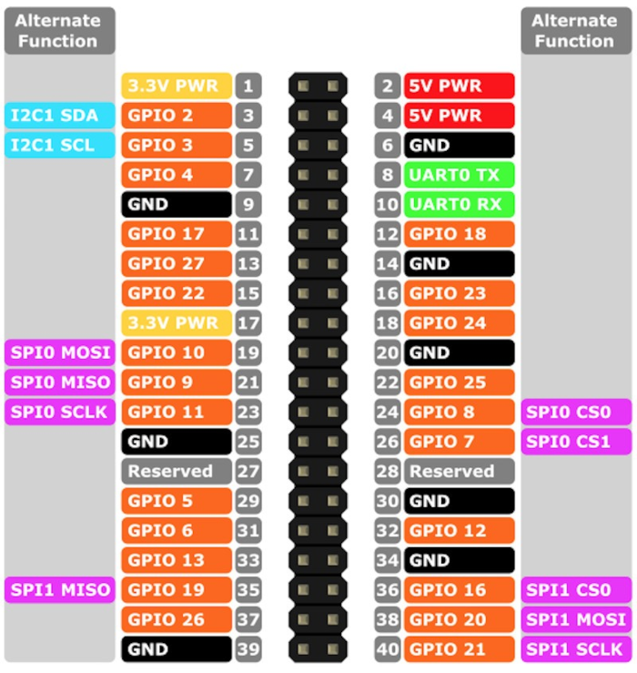

# Wiring of the sensors and the raspberry pi

The SPS30 uses 5V and all the other sensors use 3.3V.
All the sensors can be accessed via I2C by connecting all the sensor outputs to the corresponding SDA1 (GPIO2) and SCL1 (GPIO3) inputs 

## Raspberry Pi 4 Pinout overview

!TODO